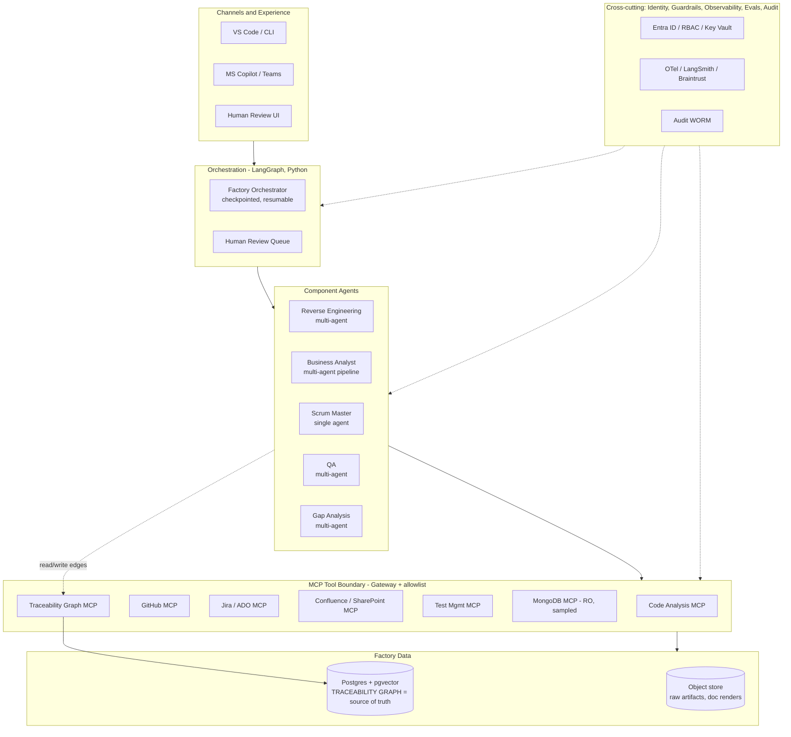
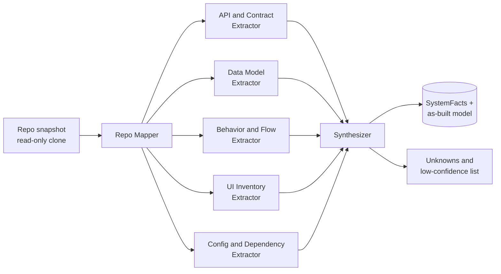
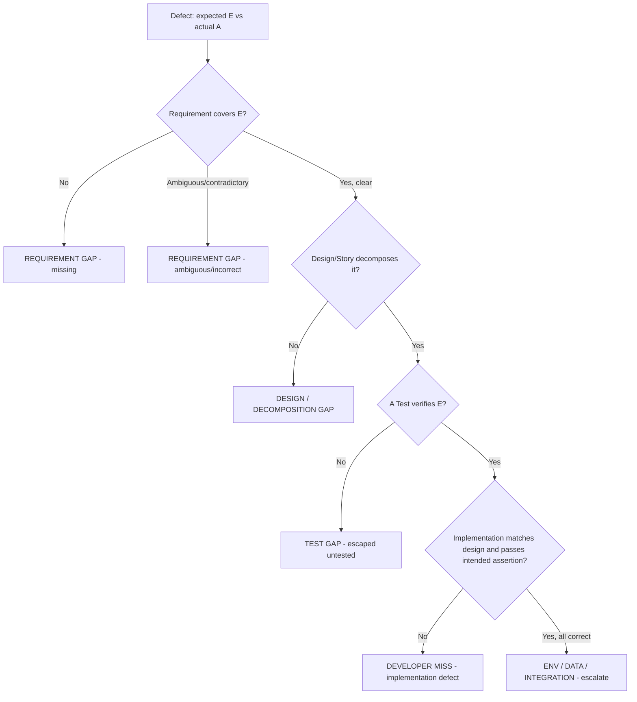

# Code Intelligence Factory — High-Level Design (HLD)

*Prepared 2026-05-29 · Owner: Raja / AaraMinds · Status: v0.1 design draft · Scope: foundation-first pass*

---

## 0. Verdict (read this first)

Build the **traceability graph as the product, not the byproduct.** The five components you listed (Reverse Engineering, BA, Scrum Master, QA, Gap Analysis) are producers and consumers of one linked, append-only artifact graph that runs from BRD down to defect-gap. If the graph and its "no link, no seal" invariant are right, gap analysis (reqs 6–7) becomes a graph walk instead of an LLM guess. If they're wrong, no amount of agent sophistication saves you.

Four decisions I'm committing to in this design, with rationale below:

1. **Topology is mixed, not uniform.** Reverse Engineering, BA, QA, and Gap Analysis are **multi-agent** (they have genuinely parallel or staged sub-concerns). Scrum Master is a **single agent** (coordination is one coherent job). Don't force every component into "orchestrator + six specialists" — that's the over-architecting trap your own diagrams flirt with.
2. **Language split is principled: Go for the deterministic backbone, Python for the reasoning.** The graph service, MCP servers, static-analysis runners, sync adapters, and APIs are **Go**. The LangGraph orchestrator and the LLM specialist agents are **Python**. This honors both your preferred languages with a clean seam instead of mixing them arbitrarily.
3. **The factory owns its traceability store (Postgres + pgvector, graph-modeled), and syncs out** to Jira/Azure DevOps and GitHub. The trackers are projections; the graph is the source of truth. (Your choice, and the right one for gap analysis.)
4. **Autonomy target is Augmented → Agent-Orchestrated, never Autonomous.** Per your req 4, developers implement. The factory analyzes, designs, plans, tracks, and adjudicates — it never writes to a production code path. The merge button stays human. This sits at Phases 1–2 of your SLDC Roadmap, deliberately not 4–5.

The rest of this document goes **deep on the traceability spine and the Reverse-Engineering component** (the foundation everything depends on) and gives **solid HLD outlines** for BA, Scrum Master, QA, and Gap Analysis, plus the cross-cutting layers, the PR template, and the gap-classification algorithm you specifically asked for.

---

## 1. Scope of this pass

| In scope (deep) | In scope (outline) | Out of scope |
|---|---|---|
| Traceability graph: nodes, edges, seal invariant, storage, IDs, versioning, sync | BA, Scrum Master, QA, Gap-Analysis component designs | Actual code implementation of any component |
| Reverse-Engineering component end-to-end | Orchestration, MCP layer, governance band | The target codebase's own redesign |
| PR template + CI trace gate (req 5) | Phasing / roadmap | Vendor selection beyond your fixed stack |
| Gap-analysis decision tree (req 6) | Eval harness shape | Cost modelling with real numbers (no baseline yet) |

**Target system under analysis:** Java Spring Boot (backend) + React JS (frontend) + MongoDB (datastore). Note the deliberate distinction throughout: **MongoDB is the *target* system's database; the *factory's* own store is Postgres.** Do not conflate them.

---

## 2. Design principles (non-negotiables)

These carry directly from your workspace governance and the discipline already encoded in your BA-agent and Token-Optimizer diagrams.

- **Traceability by construction.** No artifact reaches a sealed/ready state without its required upstream *and* downstream links populated. No link → no seal → no downstream consumption → no merge. This is the single load-bearing rule.
- **Deterministic before probabilistic.** For reverse engineering, prefer real parsers and static analysis (ASTs, OpenAPI, schema inference) over LLM guessing. The LLM narrates and infers *intent* over extracted facts and must cite `file:line`. Ungrounded claims are defects.
- **Inferred ≠ confirmed.** Everything reverse-engineered is "as-built / inferred" until a human review seals it as authoritative. The graph carries this flag on every node.
- **Draft-only on the write side.** The factory opens draft PRs, creates work items, and proposes — it never merges to a production branch and never edits source on `main`.
- **Human-in-the-loop gates** at every seal (BRD/HLD/LLD) and above a severity threshold for gap verdicts. Phased rollout: shadow → assisted → orchestrated.
- **Grounded outputs only.** JSON-schema validation on every agent output; citations to trace IDs and `file:line`; PII redaction on ingest (transcripts and any sampled MongoDB data).
- **Observable and economical.** OpenTelemetry trace per artifact (extract → seal), per-artifact cost telemetry, model tiering (cheap tier for extraction/routing, workhorse tier for analysis/authoring), and an eval gate on the accuracy-critical steps (extraction fidelity, gap classification).

---

## 3. System overview

The factory is the same layered spine you use across your diagrams — channels → orchestration → agents → MCP tool boundary → data → governance band — specialized for code intelligence.



**Control flow, happy path:** Reverse Engineering builds the as-built model → BA authors BRD/HLD/LLD/stories grounded in it → human seals → Scrum Master creates work items and tracks human implementation via PRs → QA derives the test plan and coverage edges → defects flow into Gap Analysis, which walks the graph, classifies root cause, and reopens the correct upstream artifact. Every step reads from and appends to the one graph.

---

## 4. The traceability spine (DEEP — this is the core)

### 4.1 Node taxonomy

Every node carries a common envelope: `id` (stable, typed, see 4.4), `type`, `version`, `lifecycle_state`, `provenance` (producing agent + model + run ID), `source_citations` (`file:line`, doc anchors, defect ID), `confidence`, and `inferred|confirmed` flag.

| Node | Produced by | Meaning |
|---|---|---|
| `SystemFact` | Reverse Engineering | An as-built, evidence-cited fact: an endpoint, a Mongo collection, a service flow, a config. The ground-truth layer. |
| `Requirement` | BA (Author) | A business/functional requirement (BRD line). For reverse-engineered work, derives from `SystemFact`. |
| `DesignElement` | BA (Author) | HLD component or LLD detail. Split by `level: HLD|LLD`. |
| `UserStory` | BA (Author) | INVEST story with embedded `AcceptanceCriterion` children (Gherkin). |
| `PullRequest` | Scrum Master (synced from GitHub) | A unit of human implementation. |
| `CodeArtifact` | Reverse Engineering + Scrum Master | Repo / module / file / symbol. RE seeds it; PRs touch it. |
| `Test` | QA | A test case / scenario derived from acceptance criteria. |
| `Defect` | Scrum Master (synced) | A raised defect, with expected vs. actual behavior. |
| `Gap` | Gap Analysis | A typed root-cause finding attributed to a broken link in the chain. |

### 4.2 Edge taxonomy (the actual value)

Edges are typed, directional, versioned, and themselves carry provenance. These are what make req 7 (end-to-end traceability) and req 6 (gap classification) tractable.

| Edge | From → To | Required for seal of… |
|---|---|---|
| `derives_from` | Requirement → SystemFact / stakeholder input | Requirement |
| `decomposes_to` | Requirement → UserStory | Requirement (downstream) |
| `designed_by` | Requirement → DesignElement (HLD/LLD) | Requirement, DesignElement |
| `implemented_by` | UserStory → PullRequest | UserStory (at done) |
| `touches` | PullRequest → CodeArtifact | PullRequest |
| `verified_by` | UserStory / AcceptanceCriterion → Test | UserStory (at done) |
| `covers` | Test → AcceptanceCriterion | Test |
| `reports_against` | Defect → UserStory / Requirement / CodeArtifact | Defect triage |
| `attributed_to` | Gap → the earliest broken node/edge | Gap |
| `reopens` | Gap → upstream node (Requirement/Design/Story/Test) | Gap (closes loop) |

### 4.3 The seal invariant (load-bearing)

Each component's **Validator** step enforces a state machine before a node can advance:

```
draft → reviewed → SEALED → (changed) → retired
```

A node cannot enter `SEALED` unless its **required upstream and downstream edges** (per the table in 4.2) exist and resolve to live nodes. The same rule, applied on the implementation side, becomes the CI trace gate in §13: a PR cannot merge unless its story↔PR↔test edges are present. This is one rule expressed in two places (authoring gate, merge gate), which is why gap analysis can later assume the chain is either complete or explicitly broken — never silently missing.

### 4.4 Identifiers and versioning

- **Stable, human-readable, type-prefixed IDs**: `REQ-<proj>-0001`, `STORY-…`, `HLD-…`, `LLD-…`, `TEST-…`, `PR-<repo>-<num>`, `DEF-…`, `GAP-…`. IDs never get reused; they survive requirement revisions (matches your BA agent's "stable ID survives requirement revisions").
- **Content versioning**: each node is append-only versioned (v1, v2…). Edits create a new version and a `supersedes` link; the old version is retained for audit. This is what lets a Gap point at "the version of the requirement that was live when the PR merged," not just the latest text.
- **Trace ID propagation**: a per-artifact OpenTelemetry trace ID is stamped at creation and propagated across component handoffs, so the observability trace and the traceability graph share keys.

### 4.5 Storage and the graph service (Go)

- **Source of truth: Postgres.** Model the graph relationally — `nodes` and `edges` tables with typed columns + JSONB envelope. This is plenty for the query depths here; you do not need a separate graph database to start.
- **Graph queries: recursive CTEs** for chain walks (e.g., "give me the full BRD→…→test→PR chain for `STORY-123`"). If Cypher-style ergonomics become worth it, add the **Apache AGE** extension *in the same Postgres* rather than standing up Neo4j — keep ops lean (your discipline).
- **Semantic linking: pgvector.** Embed requirements, stories, defects, and system facts so the BA can detect duplicate/related requirements and Gap Analysis can map a free-text defect to the right requirement when no explicit edge exists yet.
- **The Traceability Graph Service is a Go service** exposing both an internal gRPC/REST API (for the deterministic components) and an **MCP server facade** (so agents can query/append trace edges as tools, with the allowlist controlling who can write which edge types).
- **Raw artifacts** (extracted source snapshots, rendered BRD/HLD PDFs) live in an object store (Azure Blob / S3-compatible), referenced by node, not inlined.

### 4.6 Sync to Jira / ADO / GitHub (projections)

The graph is authoritative; trackers are projections kept in sync via MCP adapters:

- **Jira/ADO**: `Requirement`/`UserStory` → epics/stories; `verified_by` → linked tests; `Defect` ← synced in. Bi-directional but the graph wins on conflict (write-back reconciles).
- **GitHub**: `PullRequest`, `CodeArtifact`, `Defect` (issues). The PR template (§13) and a CI Action push trace status back as commit checks.
- **Sync is event-driven** (webhooks → graph) plus a periodic reconciliation sweep to catch missed events. Every external write is idempotent and carries the originating node version.

---

## 5. Reverse Engineering component (DEEP)

### 5.1 Purpose and the honesty constraint

Produce a **complete, evidence-cited, as-built model** of the target system that the BA can build requirements on. The hard constraint: **this is the layer most prone to hallucination, so it must be deterministic-first.** Every `SystemFact` cites the `file:line`, config key, or sampled document it came from. The LLM's job is summarization, naming, and *intent inference* over extracted facts — clearly labeled as inference — not invention.

### 5.2 Topology: multi-agent fan-out, then synthesize

A codebase decomposes into genuinely independent extraction concerns, so this fans out and joins (your orchestrator-specialist + fan-in pattern is the right fit here):



| Agent | Concern | Deterministic tooling (do this first) | LLM role |
|---|---|---|---|
| **Repo Mapper** | Structure, modules, build files, ownership | Parse `pom.xml`/Gradle, `package.json`, dir tree, CODEOWNERS | Summarize module purpose |
| **API & Contract Extractor** | REST surface | Spring: scan `@RestController`/`@RequestMapping`; emit OpenAPI (or read Springdoc output). React: find `fetch`/`axios` call sites + routes | Match frontend calls ↔ backend endpoints; flag mismatches |
| **Data Model Extractor** | Persistence | Spring Data: parse `@Document`/`@Field` classes + repository interfaces. **MongoDB MCP (read-only, sampled, PII-redacted)**: infer actual collection shapes & indexes | Reconcile declared model vs. observed documents; note drift |
| **Behavior & Flow Extractor** | Service logic, call graphs, sequences | AST + call-graph over service/controller layers (tree-sitter for breadth; JavaParser for Java depth) | Narrate end-to-end flows as sequences; infer use cases |
| **UI Inventory Extractor** | Frontend | tree-sitter/TS compiler: component tree, routes, state stores, API bindings | Map screens → user-facing capabilities |
| **Config & Dependency Extractor** | Profiles, env, external integrations, secrets refs | Parse `application*.yml/properties`, env, `.github/workflows`, dependency manifests | Identify external systems & integration points |
| **Synthesizer** | Join into one model | Resolve IDs, dedupe, build the `CodeArtifact` tree, attach citations | Produce the readable as-built narrative + an explicit **unknowns list** |

### 5.3 Per-language tooling (concrete)

- **Java Spring Boot**: `tree-sitter-java` for fast structural pass; **JavaParser** (a small Java helper invoked by the Go Code-Analysis runner) for symbol resolution, annotations, and call graphs; Springdoc/`springdoc-openapi` output if the app exposes it, else synthesize OpenAPI from controller annotations.
- **React JS**: `tree-sitter-javascript`/`-typescript` (or the TS compiler API for typed projects) for component/route/state extraction and locating API call sites.
- **MongoDB**: read-only, **sampled** reads via the MongoDB MCP — infer collection schemas, types, and indexes from a bounded sample; redact PII before anything reaches an LLM. Cross-check against the Spring `@Document` declarations and report divergence (a common source of latent defects).
- **Runner**: a **Go "Code Analysis" service** orchestrates these tools behind the Code Analysis MCP, shelling out to language-native helpers where they add depth. tree-sitter has Go bindings, so breadth-first parsing lives in-process; Java depth is a thin sidecar.

> Pin tool/runtime versions at implementation time against current LTS — do not hard-code versions in this design. `[VERIFY]` Go, Python, tree-sitter grammar, and JavaParser versions during the build phase.

### 5.4 Outputs and the edges RE creates

- A populated **`CodeArtifact` tree** and a set of **`SystemFact` nodes**, each `inferred` until human-confirmed, each cited.
- An **as-built narrative** (module map, API catalog, data model, key flows, external integrations) rendered to the Confluence/SharePoint MCP and stored in the object store.
- An explicit **unknowns / low-confidence register** — the single most valuable RE output, because it tells the BA and the humans exactly where the model is weakest. Refusing to fabricate here is a feature.
- **Edges seeded:** none upstream (RE is the root), but `SystemFact` nodes become the `derives_from` anchors the BA will attach requirements to. RE is what makes reverse-engineered requirements *traceable to evidence* rather than asserted.

---

## 6. Business Analyst component (outline)

**Reuse your existing BA-agent design** (the `business_analyst_agent_architecture.svg` pipeline) — it already encodes the right shape. Adapt one thing: the primary input is the RE **as-built model**, not stakeholder transcripts, so requirements are *reverse-engineered* and must be marked `inferred` until human-sealed.

- **Topology:** multi-agent **sequential pipeline** — Elicitor → Analyst → Author → Validator → Change Manager. Model-tier it (cheap tier for elicitation/extraction, workhorse tier for analysis/authoring).
- **Elicitor:** reads `SystemFact`s (and any human input), extracts candidate requirements with source citations.
- **Analyst:** detects ambiguity, conflict, duplicates (pgvector similarity); classifies functional / non-functional / constraint.
- **Author:** writes the **BRD** (business requirements), **HLD** (`DesignElement level=HLD`), **LLD** (`level=LLD`), and **User Stories** (INVEST) with **Gherkin acceptance criteria**, against a project schema.
- **Validator (sealing gate):** JSON-schema + traceability + downstream-contract checks. Enforces the seal invariant (§4.3): every requirement must have `derives_from` (→ SystemFact) and `decomposes_to` / `designed_by` populated, or it does not seal.
- **Change Manager:** on any upstream change (including a Gap reopening a requirement), computes blast radius across linked artifacts and reactivates downstream lifecycles.
- **Edges created:** `derives_from`, `decomposes_to`, `designed_by`. **Outputs to:** Confluence/SharePoint MCP (rendered docs), graph (nodes + edges), human review queue (seal).
- **BRD/HLD/LLD honesty:** documents are explicitly labeled "as-built, inferred" with a confidence band and the RE unknowns register attached, until a human seals them as authoritative.

## 7. Scrum Master component (outline)

**Single agent.** Coordination is one coherent job, and req 4 puts implementation outside scope — so this **orchestrates and tracks humans; it does not write code.**

- **Inputs:** sealed `UserStory` nodes (+ dependencies, readiness).
- **Does:** creates/updates work items in Jira/ADO and GitHub issues; sequences by dependency and readiness; attaches the PR template (§13); watches PR/CI status via the GitHub MCP; updates the graph as PRs open/merge.
- **Explicitly does NOT:** author code, merge PRs, or push to protected branches. It proposes and tracks.
- **Edges created/maintained:** `implemented_by` (Story → PR), `touches` (PR → CodeArtifact, from PR diff), and the readiness/dependency metadata. **The handoff back is the merge:** a merged PR with a complete trace closes the story's implementation edge.

## 8. QA component (outline)

**Multi-agent** (test design and coverage analysis are distinct concerns).

- **Test Designer:** derives test cases/scenarios from each `AcceptanceCriterion` (Gherkin → concrete cases, including negative and edge cases). Creates `Test` nodes.
- **Coverage Mapper:** builds `covers` (Test → AC) and `verified_by` (Story/AC → Test) edges, then computes **coverage gaps** — requirements/criteria with no test. This pre-computes exactly what Gap Analysis later needs to call "test gap."
- **(Optional) Test-Data/Env Advisor:** flags data conditions and environment needs.
- **Execution is human/external** (like dev). QA here produces the **test plan + coverage edges**, pushed via the Test Mgmt MCP (Xray/Zephyr/ADO Test Plans) and written to the graph.

## 9. Gap Analysis component (outline + decision tree — req 6)

**Multi-agent**, **defect-triggered**. This is where the spine pays off: classification is a **graph walk with cited evidence**, not an opinion.

- **Defect Interpreter:** parses the `Defect` → expected behavior `E`, actual `A`, affected area; maps to the feature via `reports_against` + pgvector similarity.
- **Trace Walker:** pulls the live chain for that feature from the graph — `Requirement → DesignElement → UserStory/AC → Test → PullRequest → CodeArtifact` — at the **versions that were live when the PR merged**.
- **Root-Cause Classifier:** walks the chain and locates the **earliest broken link** (algorithm below).
- **Recommendation Author:** writes the fix recommendation, creates a typed `Gap` node `attributed_to` the broken link, and `reopens` the correct upstream artifact (Change Manager picks it up if it's a requirement/design gap; it routes to dev if it's an implementation miss).

**Classification decision tree:**



Each verdict is emitted with **cited evidence** (the trace IDs, AC text, and `file:line` it relied on), so "developer miss" vs "requirement gap" is defensible, not asserted. Owner rejections and any misclassifications feed the eval set as trap cases (learning loop) — directly answering reqs 6 and 7.

---

## 10. Orchestration and the Go / Python boundary

- **Orchestrator: LangGraph (Python)** — a checkpointed, resumable state machine over the five components, with a human-review queue and per-artifact trace-ID propagation. Matches your stack and your other diagrams.
- **Specialist agents: Python** (LangGraph/LangChain nodes wrapping LLM calls, schema validation, prompt/eval tooling).
- **Deterministic backbone: Go** — the Traceability Graph Service, all MCP servers, the Code-Analysis runner, the sync adapters, and the public API. Go is chosen for the long-running, concurrent, deterministic services (graph writes, webhook ingest, static-analysis fan-out); Python for the reasoning where the ecosystem (LangGraph, eval libs) lives.
- **The seam:** agents reach deterministic services **only through MCP tools** (allowlisted), never by importing them. This keeps the reasoning layer swappable and the backbone testable in isolation.

## 11. MCP layer

Single **MCP Gateway** (Go): one entry point, AuthN/AuthZ via Entra ID, per-project tool **allowlist**, request tracing. Servers behind it:

| MCP server | Mode | Used by |
|---|---|---|
| Code Analysis | read-only on repo snapshot | Reverse Engineering |
| MongoDB | read-only, sampled, PII-redacted | RE Data Model Extractor |
| GitHub | draft-PR / issues / checks (no merge) | Scrum Master, CI gate |
| Jira / Azure DevOps | work-item read/write | BA, Scrum Master |
| Confluence / SharePoint | doc publish | BA |
| Test Management (Xray/Zephyr/ADO) | test-plan write | QA |
| Traceability Graph | query + scoped append | all components |

**Write-scope is enforced per edge type:** e.g., only the BA may write `designed_by`; only QA may write `covers`; only Gap Analysis may write `attributed_to`/`reopens`. The allowlist is how "traceability by construction" is enforced at the tool boundary, not just in prompts.

## 12. Governance and cross-cutting

- **Identity & access:** Entra ID, OIDC, project-scoped RBAC, per-tenant secrets in Key Vault, no cross-project bleed.
- **Guardrails:** PII redaction on ingest (transcripts, sampled Mongo docs); JSON-schema validation on every agent output; citations-only (trace IDs / `file:line`); **no write to production code paths**; draft-PR pattern enforces human merge.
- **HITL gates:** seal of BRD/HLD/LLD requires human review; Gap verdicts above a severity threshold require senior review; rollout phased shadow → assisted → orchestrated.
- **Observability:** OpenTelemetry trace per artifact (extract → seal); LangSmith for agent traces; quality metrics — extraction-fidelity, ambiguity rate, INVEST pass rate, **trace-completeness %**, **gap-classification accuracy**, time-to-seal.
- **Evals:** a golden set + trap cases (Braintrust or LangSmith evals) on the two accuracy-critical steps — RE extraction fidelity and Gap classification — gating releases on regression.
- **Audit:** WORM logs, per-decision provenance, node version history.
- **Economics:** per-project cost ceiling, model tiering, per-artifact cost telemetry; revisit auto-pause once a baseline exists. `[VERIFY]` real cost numbers — none asserted here without a baseline.

## 13. PR template + CI trace gate (req 5)

Two parts: a template that forces authors to declare trace links, and a CI Action that *verifies* them against the graph ("no link, no merge" — the seal invariant on the implementation side).

**`.github/pull_request_template.md`:**

```markdown
## What & why
<!-- One paragraph. -->

## Traceability (required — CI verifies these)
- Implements user stories: STORY-____  (one or more; required)
- Requirements (auto-derived from stories): REQ-____
- Design refs: HLD-____ / LLD-____

## Acceptance criteria (from the linked story/stories)
- [ ] AC-____ : <criterion>  — covered by test TEST-____
- [ ] AC-____ : <criterion>  — covered by test TEST-____

## Test evidence
- Tests added/updated: TEST-____
- All linked ACs have a covering test: [ ] yes  [ ] no (explain)

## Scope check
- [ ] No changes outside the linked stories (or: out-of-scope changes listed below)
- Out-of-scope / untraced changes: <list or "none">

## Reviewer
- [ ] Trace links resolve in the factory graph (CI: `trace-gate`)
```

**CI Action `trace-gate` (GitHub Actions):** on PR open/sync, calls the Traceability Graph MCP to assert: (1) every referenced `STORY-*` exists and is sealed; (2) the PR is linked `implemented_by` to ≥1 story; (3) every linked story's acceptance criteria have `verified_by` a `Test`; (4) changed files map to declared `CodeArtifact`s. Fails the check (blocks merge) if any link is missing — surfacing untraced work *before* it becomes an untraceable defect later.

---

## 14. Agent-topology summary (your delegated decision)

| Component | Single vs multi-agent | Why |
|---|---|---|
| Reverse Engineering | **Multi-agent** (fan-out + synthesize) | Genuinely parallel, independent extraction concerns; deterministic-first per concern |
| Business Analyst | **Multi-agent** (sequential pipeline) | Staged transform: elicit → analyze → author → validate → change-manage; each stage a different skill/model tier |
| Scrum Master | **Single agent** | Coordination is one coherent job; no parallel sub-concerns; humans do the work |
| QA | **Multi-agent** (designer + coverage mapper) | Test authoring and coverage analysis are distinct; coverage mapping pre-computes "test gap" |
| Gap Analysis | **Multi-agent** (interpret → walk → classify → recommend) | Staged reasoning over the graph; classifier is the accuracy-critical, eval-gated step |

Resist the urge to make Scrum Master multi-agent for symmetry — that's the over-architecting risk your own diagrams lean toward.

## 15. Phasing (foundation-first → your SLDC rungs)

| Phase | Ships | SLDC rung |
|---|---|---|
| **0 — Spine + RE** | Graph service (Go), schema, Code-Analysis MCP, RE component, as-built model + unknowns register. Shadow mode. | Assisted |
| **1 — BA** | BRD/HLD/LLD/stories from the as-built model, sealing gates, human review. | Assisted → Augmented |
| **2 — SM + trace gate** | Work-item sync, PR template, `trace-gate` Action; live implementation tracking. | Augmented → Orchestrated |
| **3 — QA** | Test-plan generation + coverage edges. | Orchestrated |
| **4 — Gap Analysis** | Defect-triggered classification + reopen loop + eval harness. | Orchestrated |

Each phase ships only the trace edges it owns; the graph grows left-to-right and is queryable end-to-end as soon as Phase 2 lands.

## 16. Key risks and open decisions

1. **RE fidelity is the make-or-break.** If the as-built model is wrong, every downstream artifact inherits the error. Mitigation: deterministic-first, mandatory citations, the unknowns register, and a human seal before BA consumes it. This is why Phase 0 ships in *shadow* mode.
2. **Graph store evolution.** Start Postgres + recursive CTEs + pgvector. Decision point: adopt Apache AGE only if chain queries get awkward; avoid Neo4j unless a real query need forces it. **Open: confirm Jira vs Azure DevOps as the primary tracker** (changes the sync adapter you build first).
3. **Defect→requirement mapping** when no explicit edge exists yet relies on embeddings; budget for a human-confirm step on low-similarity matches before trusting a gap verdict.
4. **Scope creep toward autonomy.** Keep the merge button human. The moment the factory writes to `main`, the governance story and your liability change entirely.
5. **`[VERIFY]` at build time:** runtime/tool versions, and all cost figures (no baseline exists yet).

## 17. What I'd build first

The **Traceability Graph Service + schema + the Code-Analysis MCP + the Reverse-Engineering component**, end-to-end, on one real repo, in shadow mode — producing the as-built model, the unknowns register, and a queryable `SystemFact`/`CodeArtifact` graph. That single slice proves the spine, the Go/Python seam, the MCP boundary, and the deterministic-first discipline — and everything else attaches to it.

---

*Built on the AaraMinds house architecture (orchestrator + specialists + MCP + governance band) and the traceability-by-construction discipline from your BA-agent and Token-Optimizer designs. Per `.claude/CLAUDE.md`, this analysis can also live under `governance/`; saved alongside the diagrams as the work originated there.*
