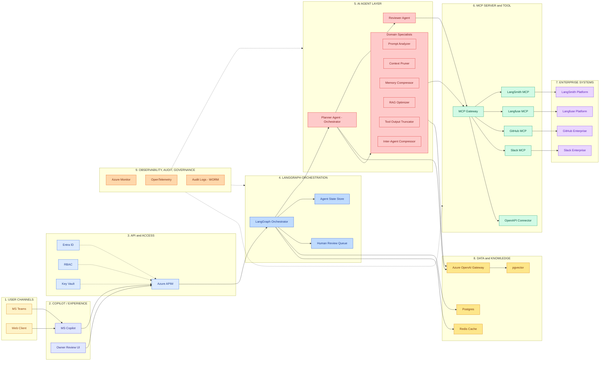
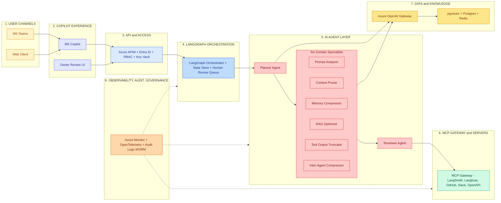

# TokenOptimizer Architecture — Mermaid Version

## Architecture summary

TokenOptimizer is a multi-agent system that analyzes LLM traces from connected
systems and produces ranked token-reduction recommendations across six waste
domains (prompts, context, memory, RAG, tool outputs, inter-agent messages).
The orchestrator fans out to six specialist agents in parallel, aggregates and
ranks findings by impact/risk ratio, and emits draft GitHub PRs that owners
review and merge. Cross-cutting controls (Entra ID, Key Vault, RBAC,
observability, audit) span the full stack. The system never modifies production
code directly — recommendations only.

## Mermaid diagram (initial)

## Critical review of the diagram

What works:
- Nine layers are visible as labeled subgraphs with consistent ordering
- Six specialists are visually grouped without sprawling the agent layer
- Cross-cutting concerns (Entra ID, RBAC, Key Vault) use dotted lines to
  signal they wrap rather than flow through
- Observability connects to multiple layers via dotted edges, signaling
  cross-cutting

What's weak:
- The flow direction is left-to-right per the design rules, but the dense
  cross-cutting edges create visual noise — Entra ID/RBAC/Key Vault should
  ideally render as a vertical band, but Mermaid's auto-layout fights this
- 34 named components — over the 30-component soft limit. Specifically,
  the four "Enterprise Systems" boxes (LangSmith Platform, Langfuse Platform,
  GitHub Enterprise, Slack Enterprise) are end-states that don't change the
  architecture story; they could be implied by the MCP layer
- The Planner/Reviewer/Specialists relationship is shown as edges but the
  fan-out/fan-in pattern doesn't render visually distinctively — looks like
  a tree, not a fork-join
- Mermaid will render this with auto-routed edges that may cross; layout
  quality depends on the renderer

## Improved Mermaid diagram

Changes in the improved version: collapsed end-state Enterprise Systems
boxes into the MCP layer (they're implied), grouped API+identity+secrets
into a single APIM box (the access layer is one logical concern, not
four), made the fan-out pattern (Planner → Specialists → Reviewer)
visible as a left-center-right flow within the agent layer, dropped from
34 to 18 named components.

## Draw.io XML

See companion file `tokenoptimizer_drawio.xml` — import into draw.io via
File → Import → Device, then adjust layout and styling as needed.
