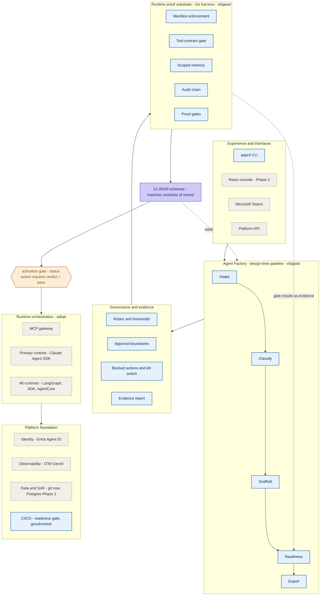

# AaraMinds Agent Platform — Architecture

Layered container view of the platform as it stands (2026-07-05). Grounded in the shipped code under `platform/`, the schemas under `schemas/`, and the governance config under `governance/`. See `DOCUMENT-MAP.md` for document authority.

Legend: **built** = AaraMinds-built and tested (blue); **adopt** = adopted, external, or a later phase (gray, dashed).

## How to read it

The platform is **built top-down and depends bottom-up**. The upper region is design-time and AaraMinds-built; the lower region is the adopted runtime and infrastructure. The two are separated by a single control — the **activation gate**.

**Experience.** Today the only shipped interface is the `aapctl` CLI. Console, Teams, and API are later phases (BRD §10.2).

**Agent Factory (the differentiator).** A deterministic, no-LLM pipeline: `intake → classify → scaffold → readiness → export`, one `aapctl` subcommand each. It turns an agent idea into a governed, evidence-scored artifact folder. Determinism is the point — a reproducible factory is what makes the readiness verdict trustworthy.

**Governance and evidence.** The `readiness` stage reads the versioned rubric (`governance/readiness-rubric.yaml`, 9 weighted areas), approval boundaries, the blocked-actions deny-list, and produces a per-check, evidence-cited report. No score is self-attested; every point traces to a file, gate result, or audit event.

**Runtime proof substrate (the Go harness).** The shipped enforcement engine: manifest control (no off-manifest tool calls), MCP tool-contract gating, engagement-scoped memory with citation enforcement, a tamper-evident audit chain, and proof gates for prompt-injection escalation and tool/memory denial. The readiness engine runs this harness and consumes its gate results as evidence (the dotted arrow).

**Machine contracts of record.** Thirteen JSON schemas are the shared source of truth; every generated artifact validates against one, and the factory validates against them (the second dotted arrow).

**Activation gate.** A manifest cannot move to `status: active` unless a current readiness report scored under the live rubric returns verdict `pass`. This is the one hard control separating design-time from production — enforced in code (`ActivationGate`), not policy.

**Runtime orchestration (adopt, not build).** The platform orchestrates existing runtimes and adopts an MCP gateway; it never rebuilds them. Claude Agent SDK is the primary runtime target ([VERIFY] per PRD §6); LangGraph, Google ADK, and Bedrock AgentCore are portable alternatives.

**Foundation.** Identity via the Entra Agent ID pattern (OAuth2 / workload identity federation); observability via OpenTelemetry GenAI semantic conventions into Grafana/Prometheus; the system of record is git today, PostgreSQL in Phase 2; CI/CD is shipped, running the readiness gate and `govulncheck` on every change. Deployment is Azure-first: AKS / Container Apps, GitHub Actions with OIDC, Terraform AzureRM, Key Vault via managed identity.

**Standards.** MCP (pinned `2025-11-25`), OTel GenAI, OWASP ASI 2026, NIST AI RMF, ISO/IEC 42001, and EU AI Act obligations; A2A is a future interoperability layer.

## What is real vs planned

Everything marked **built** is code with tests in `platform/` and is exercised by CI. Everything marked **adopt** is an integration point that is either a later phase or an external component the platform composes rather than owns. The reference agent (`agents/aara-business-analyst`) currently scores a readiness **pass** through the full pipeline.
