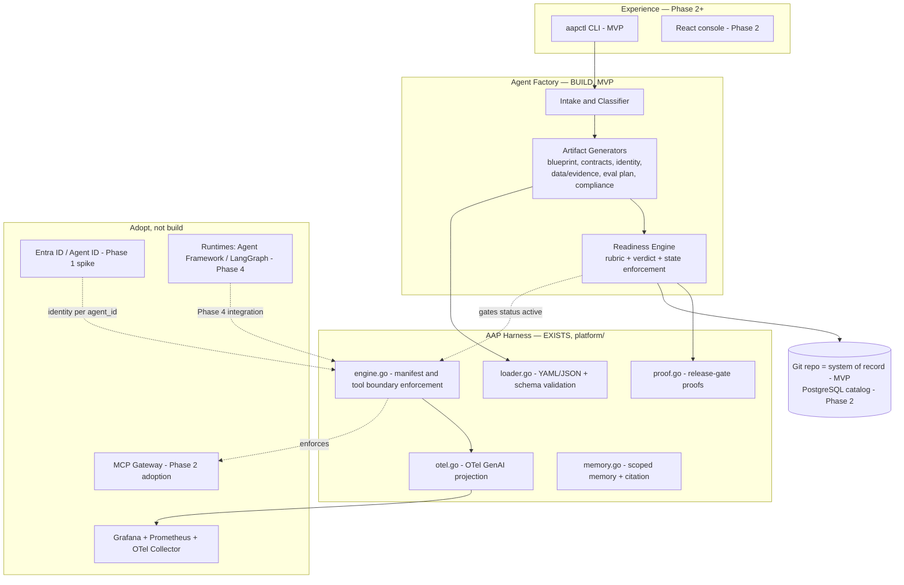

# Reference Architecture (MVP → Phase 2)

Implements BRD v2.1 §14 with the existing AAP harness as the foundation. Build the differentiating layers; adopt the commodity ones.

## Component view

## Decisions

| Area | Decision | Rationale |
|---|---|---|
| System of record (MVP) | Git repo, folder per agent | Artifacts are files; validation in CI; no DB before the model stabilizes. PostgreSQL catalog in Phase 2 when the web console needs queries. |
| Control plane language | Go (extend `platform/`) | Harness is Go; stack standard; single binary `aapctl` distribution. |
| Validation | JSON Schema (existing `schemas/`) + Markdown section validator | Already proven by loader/engine; extend, don't replace. |
| Readiness | New `internal/readiness` package consuming `proof.go` gate results | Design-time rubric composes runtime proof gates (see rubric doc). |
| Identity | Entra Agent ID pattern; managed identity per `agent_id`; local dev fallback without shared prod credentials | Open item in runtime-verification-notes — Phase 1 spike. |
| Gateway | Adopt in Phase 2; selection criteria per OQ-004 | Do not build. Harness tool-boundary enforcement remains the design-time proof. |
| Observability | OTel GenAI semconv (`invoke_agent`, `execute_tool` spans; `aap.*` for governance) → Collector → Grafana/Prometheus | Matches existing `otel.go`; validate collector compatibility before production (open item). |
| Deployment | `aapctl` binary + GitHub Actions (OIDC) CI validating agent folders; containerized services only when the Phase 2 console arrives (AKS/Container Apps, Terraform AzureRM, Key Vault via managed identity) | Don't stand up infrastructure the MVP doesn't need. |

## What deliberately does not exist yet

No database, no web UI, no gateway integration, no runtime execution, no A2A. Each has a named phase and an open verification item; building them early is the R-001 (platform too broad) failure mode.
