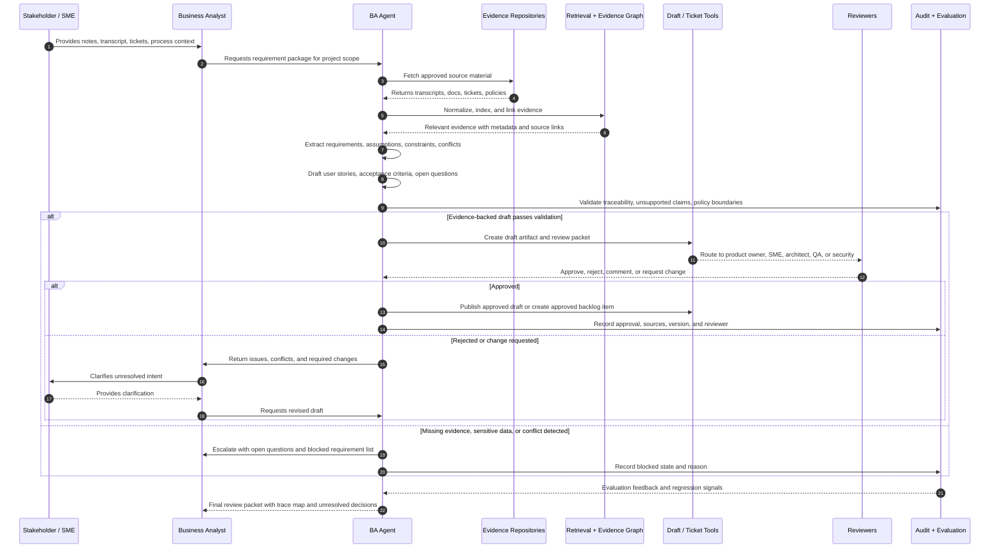

# Business Analyst Agent Blueprint — Final Version

## Job-to-be-done

For enterprise product, delivery, and transformation teams, the Business Analyst Agent converts stakeholder inputs, process evidence, and system context into traceable requirements, user stories, acceptance criteria, open questions, and change-impact notes, targeting 30-50% reduction in BA drafting and rework time `[VERIFY]` while improving requirement traceability and ambiguity detection.

## Agent Justification

This use case justifies an agent, but only as a human-gated business analysis assistant.

A deterministic workflow can template a BRD, rename fields, or turn a form into a user story. That is not the hard part of business analysis.

The hard part is synthesizing ambiguous stakeholder intent across interviews, tickets, process documents, policies, system behavior, and prior decisions while preserving evidence and surfacing conflicts before delivery starts.

Agentic behavior is justified because the work requires:

- Context gathering across heterogeneous sources.
- Ambiguity detection and follow-up question generation.
- Traceable synthesis from source evidence to requirement statements.
- Iterative refinement based on stakeholder feedback.
- Routing outputs through human review before anything becomes authoritative.

The bounded autonomy posture is safe because the agent drafts, compares, traces, and routes. It does not approve scope, change commitments, reprioritize roadmap items, or update systems of record without human approval.

## Scope and Boundary

### In scope

- Ingest stakeholder notes, meeting transcripts, tickets, process documents, system screenshots, policy documents, and existing requirements.
- Extract candidate business requirements, functional requirements, non-functional requirements, assumptions, constraints, dependencies, and open questions.
- Draft user stories, acceptance criteria, process summaries, decision logs, and change-impact notes.
- Link every output claim back to source evidence.
- Identify ambiguity, missing actors, missing business rules, conflicting statements, and unstated dependencies.
- Suggest follow-up questions for stakeholders, product owners, architects, QA, security, and operations.
- Route drafts for human review, comment, revision, approval, or rejection.
- Maintain version history and change rationale.

### Out of scope

- Final approval of requirements.
- Scope, timeline, cost, or prioritization decisions.
- Roadmap ownership.
- Contractual, legal, compliance, or regulatory sign-off.
- Direct creation or modification of production system configuration.
- Automatic Jira / Azure DevOps status changes without approval.
- Replacing product managers, business analysts, solution architects, QA leads, or domain owners.

### Human-only

- Approving requirements as authoritative.
- Resolving stakeholder conflicts.
- Prioritizing backlog items.
- Accepting user stories into sprint scope.
- Approving change requests with delivery, cost, regulatory, or customer impact.
- Making product, process, compliance, or operating-model commitments.

## Agent Decomposition

### Decision

Use a single-agent design for v1: one trace-first BA orchestration agent with deterministic extraction helpers, retrieval, policy checks, and human review gates.

### Rationale

The workflow is mostly sequential:

1. Gather context.
2. Extract candidate requirements.
3. Check ambiguity and conflict.
4. Draft artifacts.
5. Link claims to sources.
6. Route for review.
7. Revise based on feedback.

Splitting this into separate agents too early would increase coordination overhead and weaken traceability. A single orchestrated agent can maintain one evidence graph, one decision log, and one review state across the requirement lifecycle.

### Rejected alternative

Rejected v1 design: multi-agent crew with separate elicitation, requirements, process, QA, and review agents.

Concrete failure mode: each specialist would interpret the same stakeholder evidence differently, producing duplicate context retrieval, inconsistent terminology, and conflicting requirement traces. That makes review harder, not easier, until the organization has enough volume and evaluation data to justify specialist separation.

### Capabilities

1. Evidence intake and normalization
   - Converts transcripts, notes, tickets, docs, and process material into structured evidence records.

2. Requirement extraction
   - Produces candidate business, functional, non-functional, assumption, constraint, dependency, and open-question records.

3. Ambiguity and conflict detection
   - Flags vague verbs, missing actors, missing business rules, contradictory stakeholder statements, duplicate requirements, and unowned decisions.

4. Artifact drafting
   - Drafts BRD sections, user stories, acceptance criteria, process summaries, decision logs, and change-impact notes.

5. Traceability and change impact
   - Links each requirement to evidence, stakeholder source, version, related decisions, dependent systems, and impacted downstream artifacts.

6. Review routing
   - Sends drafts to product owner, domain SME, architect, QA, security, or operations reviewer based on content and risk.

## Foundation and Stack

### Stack selection decision

1. Autonomy posture
   - Human-gated background analyst. The agent drafts and routes; humans approve.

2. State and control model
   - Durable workflow with review checkpoints, version history, evidence graph, and approval state.

3. Framework or runtime
   - Default assumption: Azure-first regulated enterprise with Microsoft 365, Teams, SharePoint, Entra ID, and Azure DevOps.
   - Default runtime: Microsoft Agent Framework / Azure AI Foundry-style implementation `[VERIFY]` because identity, document access, audit, Teams/SharePoint integration, and enterprise governance are likely load-bearing.
   - Switch to LangGraph if the organization needs stack-neutral durable orchestration, custom state machines, or stronger framework portability.
   - Switch to OpenAI Agents SDK if the team is OpenAI-standardized and needs tool handoffs, guardrails, and hosted agent workflows `[VERIFY]`.
   - Switch to LlamaIndex if the workload is primarily document/RAG-heavy and less workflow-heavy.

4. Model
   - Chosen last, after data boundaries, review workflow, tool access, and evaluation are defined.
   - Use a strong reasoning model for synthesis and ambiguity detection.
   - Use smaller/cheaper models only for classification, deduplication, formatting, and low-risk extraction after evaluation proves quality.

### Foundation

- LLMs
  - Primary reasoning model for requirement synthesis, conflict detection, and reviewer-question generation.
  - Secondary low-cost model for classification and formatting where safe.

- Retrieval layer
  - Hybrid retrieval over stakeholder notes, transcripts, tickets, policy docs, architecture docs, process maps, and historical requirements.
  - Metadata filters for project, domain, stakeholder, system, date, version, and confidentiality level.

- Memory
  - Project-scoped memory only.
  - Stores terminology, known decisions, open questions, stakeholder preferences, glossary terms, and approved requirement patterns.
  - No cross-client or cross-tenant memory.

- Storage
  - Evidence store for raw and normalized source records.
  - Requirement store for structured outputs.
  - Traceability graph linking source -> requirement -> artifact -> review -> decision.
  - Versioned draft store for BRDs, stories, acceptance criteria, and decision logs.

- Identity
  - Enterprise SSO through Entra ID or equivalent.
  - Role-based access for BA, product owner, SME, architect, QA, security, operations, and delivery lead.

- Secrets
  - Secrets manager for tool credentials.
  - No secrets in prompts, memory, traces, or generated artifacts.

- Data sources
  - Teams / meeting transcripts.
  - SharePoint / Confluence.
  - Jira / Azure DevOps.
  - ServiceNow or workflow tools.
  - Existing BRDs, process maps, policies, API docs, architecture notes, and test cases.

- Runtime environment
  - Private enterprise runtime with audit logging, network controls, workspace isolation, and data retention policy.

### Stack

- Orchestration framework
  - Microsoft-native default under the stated Azure-first assumption `[VERIFY]`.
  - LangGraph as stack-neutral fallback for durable state, checkpoints, and human review waits.

- MCP servers or tool adapters
  - Document repository adapter.
  - Ticketing/backlog adapter.
  - Meeting transcript adapter.
  - Requirements repository adapter.
  - Review-routing adapter.

- Tools and integrations
  - Read tools for documents, tickets, process repositories, glossary, policy, architecture, and historical requirements.
  - Write tools limited to draft creation, comments, review requests, and approved artifact updates.

- Evaluation platform
  - Requirement-quality eval harness.
  - Traceability eval.
  - Ambiguity/conflict detection eval.
  - Human review sampling.

- Observability
  - Traces for retrieval, source selection, draft generation, tool calls, reviewer routing, and approval state.
  - Metrics for cycle time, rework, ambiguity catch rate, source coverage, hallucinated requirement rate, and reviewer override rate.

- Deployment platform
  - Enterprise cloud environment with private networking and audit controls.

- CI/CD and release process
  - Prompt/version registry.
  - Evaluation gate before release.
  - Canary by project/domain.
  - Rollback to previous prompt, model, retrieval config, and routing policy.

## Cross-Cutting Controls

Control pattern: Trace-first human-gated analysis.

- Input validation
  - Validate source type, project, stakeholder, confidentiality level, tenant, timestamp, and document version.

- Output validation
  - Every requirement must include type, owner, source link, confidence, ambiguity status, and review state.
  - Reject outputs that lack evidence links unless explicitly labeled as an assumption or open question.

- Tool allowlists
  - Read-only by default.
  - Write tools limited to draft artifacts, comments, review tasks, and approved updates.
  - No direct backlog status change without human approval.

- AuthN and AuthZ
  - Enforce role-based access at source retrieval, draft visibility, reviewer routing, and artifact publishing.

- Tenant / workspace boundaries
  - Project and client isolation.
  - No retrieval across project boundaries unless explicitly approved.

- PII and sensitive data handling
  - Classify source material before retrieval.
  - Redact or restrict sensitive HR, customer, financial, legal, or regulated data.
  - Mark outputs containing sensitive content.

- Secrets isolation
  - Tool credentials stored outside model context.
  - No credentials in generated documents or traces.

- Audit logs
  - Record source access, tool calls, draft generation, review routing, approvals, rejections, and final artifact publication.

- Traces and spans
  - Trace retrieval decisions, selected evidence, generated requirements, reviewer routing, model version, prompt version, and validation outcomes.

- Metrics
  - Draft cycle time.
  - Review turnaround time.
  - Rework rate.
  - Open-question closure rate.
  - Requirement ambiguity rate.
  - Trace completeness.
  - Reviewer override rate.

- Cost telemetry
  - Cost per requirement package.
  - Cost per reviewed requirement.
  - Cost per approved artifact.
  - Retrieval and model cost by project.

- Human-in-loop checkpoints
  - Draft review before publication.
  - Approval before backlog creation/update.
  - Escalation for conflicts, low confidence, compliance-sensitive requirements, or missing source evidence.

- Escalation paths
  - Product owner for scope conflict.
  - SME for domain ambiguity.
  - Architect for system dependency.
  - QA lead for testability gap.
  - Security/compliance for regulated data or control issues.

- Rollback or kill switch
  - Disable write tools.
  - Freeze draft publication.
  - Roll back prompt/model/retrieval configuration.
  - Revert generated artifacts to prior approved versions.

## Defining Operational Constraint

Traceability-by-Construction.

The agent loses its reason to exist if requirements cannot be traced back to source evidence, stakeholder intent, decision history, and review state.

The LLM may synthesize, compare, draft, and question. It may not invent requirements, silently collapse conflicting stakeholder statements, or publish untraceable analysis as authoritative.

Every requirement-level output must be either:

- Evidence-backed.
- Marked as an assumption.
- Marked as an open question.
- Marked as a conflict requiring human resolution.

## Evaluation and Feedback Loop

### Golden set

Build a project-level golden set from:

- Historical stakeholder notes and approved requirements.
- Meeting transcripts with known outcomes.
- Tickets with accepted user stories and acceptance criteria.
- Process documents with approved business rules.
- Past change requests with known downstream impact.
- Examples of ambiguous, conflicting, duplicate, and underspecified requirements.

### Scorers

Output quality:

- Requirement completeness.
- Requirement clarity.
- Acceptance-criteria quality.
- Business-rule extraction accuracy.
- User-story structure.
- Non-functional requirement coverage.

Intermediate behavior:

- Source retrieval relevance.
- Evidence-link correctness.
- Tool-call correctness.
- Reviewer-routing correctness.
- Version and change-log accuracy.
- Open-question generation quality.

Safety and policy:

- Hallucinated requirement rate.
- Unsupported claim rate.
- PII leakage.
- Confidentiality-boundary violations.
- Human-only boundary violations.
- Compliance-sensitive output routing.

Economic / latency / reliability:

- Cost per reviewed requirement package.
- Time to first draft.
- Review cycle time.
- Rework reduction target `[VERIFY]`.
- Retrieval latency.
- Failed tool-call rate.

### CI gate

Release only if:

- Hallucinated requirement rate is below agreed threshold.
- Evidence-link accuracy meets target threshold.
- Human-only action violations are zero.
- Reviewer-routing accuracy meets target threshold.
- Regression suite passes on ambiguity, conflict, and traceability cases.
- Cost per reviewed requirement package remains within budget ceiling `[VERIFY]`.

### Feedback loop

- Reviewer corrections feed into project memory after approval.
- Rejected outputs become negative examples.
- Missing-source cases update retrieval strategy.
- Repeated ambiguity patterns update elicitation prompts.
- Production incidents or missed requirements become golden-set additions.

## Lifecycle and Deployment

### Plan

- Select one domain and one artifact type first, such as user stories from stakeholder interviews.
- Define source systems, reviewer roles, confidentiality rules, and output templates.
- Build the first golden set from completed projects.

### Build

- Implement evidence ingestion, retrieval, structured requirement extraction, traceability graph, review routing, and draft artifact generation.
- Keep write tools disabled except draft/comment creation.

### Test

- Run against historical projects.
- Compare generated requirements with approved artifacts.
- Test ambiguity, conflict, missing-source, duplicate, and sensitive-data cases.

### Deploy

- Pilot with one delivery team for two cycles.
- Publish drafts only after human approval.
- Keep authoritative systems of record human-controlled.

### Monitor

- Track trace completeness, reviewer overrides, rework, cycle time, cost, latency, and unsupported-claim rate.
- Audit sampled outputs weekly during pilot.

### Learn

- Update project glossary, retrieval filters, templates, reviewer rules, and golden sets.
- Expand to additional domains only after two clean cycles.

### Hosting

- Enterprise cloud runtime in the organization's approved environment.
- Azure-first default if the enterprise uses Microsoft 365, SharePoint, Teams, Entra ID, and Azure DevOps.

### Cost ceiling

- Pilot target: keep monthly runtime cost below an agreed project budget, suggested starting ceiling $1,000-$2,500/month `[VERIFY]` depending on volume, model choice, transcript length, retrieval size, and tool pricing.

### Rollback

- Disable write tools.
- Revert to prior prompt/model/retrieval configuration.
- Freeze generated draft publication.
- Restore last approved artifact versions.

## Principles, Anti-Patterns, and Phased Rollout

### Principles

- Traceability beats fluency.
- Open questions are better than invented certainty.
- Drafts are useful; approvals remain human.
- Optimize for cost-per-approved-requirement, not cost-per-token.
- The agent should reduce rework, not create more review burden.
- Better BA automation starts with better evidence discipline.

### Anti-patterns

- Treating stakeholder notes as complete requirements.
- Publishing requirements without evidence links.
- Letting the agent resolve stakeholder conflict silently.
- Turning every ambiguity into a confident user story.
- Auto-creating backlog items without product-owner approval.
- Optimizing for pretty BRDs instead of delivery-ready requirements.
- Mixing tenants, projects, or confidential domains in retrieval.
- Using memory as an uncontrolled source of truth.
- Splitting into multiple BA agents before single-agent traceability is proven.

### Phased rollout

Phase 1: Read-only analysis and draft generation

- Ingest sources.
- Extract candidate requirements.
- Generate open questions.
- Draft artifacts.
- No writes to authoritative systems.

Exit criterion:

- Two clean project cycles with high trace completeness, low unsupported-claim rate, and reviewer acceptance above agreed threshold.

Phase 2: Human-gated artifact routing

- Route drafts to reviewers.
- Create draft tickets or backlog items only after approval.
- Record reviewer feedback and change rationale.

Exit criterion:

- Reviewer-routing accuracy and rework reduction meet pilot targets `[VERIFY]`.

Phase 3: Controlled system-of-record updates

- Allow approved updates to requirements repository or backlog tooling.
- Keep status changes and scope decisions human-only.

Exit criterion:

- Audit confirms no human-only boundary violations and no untraceable published requirements.

Autonomous scope approval remains out of scope.

## Acceptance Criteria for Systems Review

A later Systems Review Advisor should treat the blueprint as faithfully implemented only if:

1. Scope fidelity
   - The system drafts, traces, and routes requirements but does not approve scope, priority, budget, or roadmap decisions.

2. Agent decomposition fidelity
   - The implementation remains single-agent unless a documented multi-agent migration explains distinct cognitive domains and preserves traceability.

3. Defining operational constraint
   - Every requirement output is evidence-backed, assumption-labeled, open-question-labeled, or conflict-labeled.

4. Tool access
   - Tool calls are allowlisted, authenticated, observable, and read-only by default.

5. Data boundaries
   - PII, secrets, tenant boundaries, project boundaries, and confidentiality rules are enforced.

6. Control plane
   - Input validation, output validation, policy checks, approvals, escalation, rollback, and kill switch are implemented.

7. Evaluation
   - Golden set, scorers, CI gate, regression process, and reviewer feedback loop are live.

8. Observability
   - Traces, audit logs, cost telemetry, latency telemetry, retrieval logs, and reviewer actions are available.

9. Failure modes
   - Missing evidence, conflicting stakeholders, sensitive data, failed retrieval, failed tool call, and low confidence all trigger fallback, escalation, or human review.

10. Architecture fidelity
   - The deployed system still matches the workflow sequence and architecture poster specification.

Re-review triggers:

- New write-capable tool.
- Automatic backlog creation or status update.
- Shift from draft assistant to approval authority.
- Expansion into a new business domain, tenant, or regulated data class.
- Move from single-agent to multi-agent.
- Material increase in unsupported claims, reviewer overrides, rework, cost, latency, or incidents.
- Missing traceability for published requirements.

## Workflow Sequence Diagram

## Architecture Poster Specification

Canvas: 1600 x 1000

Theme: white enterprise architecture poster

Visual quality: engineering-grade documentation quality. Board-deck polish should go through Module 2 or a design pass.

### Header

Title:

Business Analyst Agent

Subtitle:

Trace-first requirements synthesis for enterprise delivery teams

Header tags:

- Human-gated
- Evidence-backed
- Single-agent v1
- Traceability-by-Construction

### Left context panel

Show the operating context:

- Stakeholders and SMEs
- Business analysts
- Product owners
- Architects
- QA leads
- Security/compliance reviewers
- Delivery teams

Show source inputs:

- Meeting transcripts
- Stakeholder notes
- Tickets
- Existing BRDs
- Process docs
- Policy docs
- Architecture docs
- Historical requirements

Boundary labels:

- In scope: draft, trace, question, route
- Human-only: approve, prioritize, commit, sign off

### Center orchestration / agent / MCP panel

Show one main BA Agent box with six internal capability tiles:

1. Evidence intake
2. Requirement extraction
3. Ambiguity and conflict detection
4. Artifact drafting
5. Traceability and change impact
6. Review routing

Place tool gateway / MCP boundary below the agent:

- Document adapter
- Transcript adapter
- Ticket/backlog adapter
- Requirements repository adapter
- Review-routing adapter

Show all write paths as gated.

### Defining operational constraint callout strip

Dedicated horizontal strip:

Traceability-by-Construction

Every requirement must be evidence-backed, assumption-labeled, open-question-labeled, or conflict-labeled before review.

Use a restrained teal accent for this strip.

### Right controls and observability panel

Show control layers:

- Input validation
- Output validation
- Tool allowlists
- RBAC
- PII / confidentiality controls
- Audit logs
- Human approval
- Escalation
- Rollback / kill switch

Show observability:

- Traces
- Source coverage
- Unsupported-claim rate
- Reviewer overrides
- Cost per reviewed requirement
- Cycle time

### Foundation strip

Show foundation services:

- LLMs
- Hybrid retrieval
- Evidence store
- Traceability graph
- Project memory
- Identity provider
- Secrets manager
- Evaluation harness
- Deployment runtime

### Typical flow strip

Use a left-to-right flow:

Source intake -> Evidence graph -> Requirement extraction -> Draft artifact -> Trace validation -> Human review -> Approved artifact / change request -> Feedback loop

### Failure modes to show

- Missing source evidence
- Conflicting stakeholder statements
- Sensitive data exposure
- Failed retrieval
- Unsupported requirement claim
- Wrong reviewer routing
- Human-only boundary violation

### Module handoffs

- Module 5 handoff: use for deeper architecture review, trust boundaries, FMEA, failure-mode review, and systems-review readiness.
- Module 7 handoff: use for current framework/runtime capability, pricing, model, and tool verification.
- Module 2 handoff: use for board-ready visual refinement or final architecture poster design.
